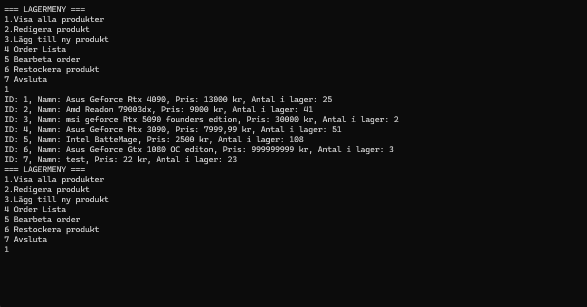

# Toms Lagerhanteringssystem – Tom Ekstrand

## Projektbeskrivning

Jag har valt alternativet **Lagerhanteringssystem**.  
Programmet låter användaren visa produkter, lägga till nya, redigera befintliga, fylla på lagret och bearbeta ordrar.  
All data sparas i en CSV-fil så att ändringar finns kvar mellan körningarna.

## Innehåll

Projektet innehåller:

- **Klasser för lagerhantering**  
  - `Produkt` representerar en enskild produkt med ID, namn, pris och antal i lager.  
  - `Lager` hanterar listan av produkter, laddar och sparar data från/till CSV, samt visar hela lagret.  
  - `Register` innehåller logik för att redigera produkter, lägga till nya, fylla på lagret och bearbeta ordrar.

- **Program.cs**  
  Kör själva applikationen och visar en meny där användaren kan:  
  - Visa alla produkter  
  - Redigera eller lägga till produkter  
  - Fyll på produkter i lager  
  - Bearbeta kundordrar  

- **Användning av C#-koncept**  
  - **Konstruktörer** används för att skapa objekt av `Lager` och `Register`.  
  - **Metoder och egenskaper** används för att kapsla in logik för lagerhantering.  
  - **Listor och LINQ** används för att hantera produktdata på ett dynamiskt sätt.  
  - **Filhantering** används för att läsa/skriva produkter till CSV, så ändringar sparas mellan körningar.

- **Menybaserat gränssnitt**  
  Programmet körs i konsolen och användaren kan enkelt välja vad som ska göras genom menyval.

## Skärmbild




*Bild: Programmet körs och visar menyn för att visa, redigera eller fylla på produkter.*

## Hur man kör

1. Öppna projektet i Visual Studio  
2. Se till att filen `produkter.csv` finns i projektmappen  
3. Kör programmet via **Program.cs**

## Hur man använder programmet

När programmet körs visas en meny med alternativ.  
Skriv siffran för det alternativ du vill använda och tryck **Enter**:

- `1` – Visa alla produkter i lagret  
- `2` – Lägg till en ny produkt  
- `3` – Redigera en befintlig produkt (ange produkt-ID och välj vad du vill ändra)  
- `4` – Visa alla ordrar  
- `5` – Bearbeta ordrar (minskar lagersaldo automatiskt)  
- `6` – Restockera produkt (ange produkt-ID och antal som ska fyllas på)  
- `7` – Avsluta programmet  

Alla ändringar sparas direkt till `produkter.csv`.

## Funktioner

### Grundfunktioner
- [x] Visa alla produkter
- [x] Redigera befintliga produkter
- [x] Lägga till nya produkter
- [x] Fyll på lagersaldo
- [x] Spara/ladda produkter från CSV-fil

### Extra funktioner (för VG)
- [x] Bearbeta kundordrar och automatiskt minska lagersaldo
- [x] Stöd för bulk-import av nya produkter (har laggt till)

## Projektstruktur

```text
projektmapp/
├── Program.cs          # Huvudprogram och meny
├── LagerDataBass.cs    # Lager- och produktklasser
├── Register.cs         # Logik för redigering, ordrar och restock
├── produkter.csv       # Datafil med produkter
├── screenshot.png      # Skärmbild av programmet
└── README.md
